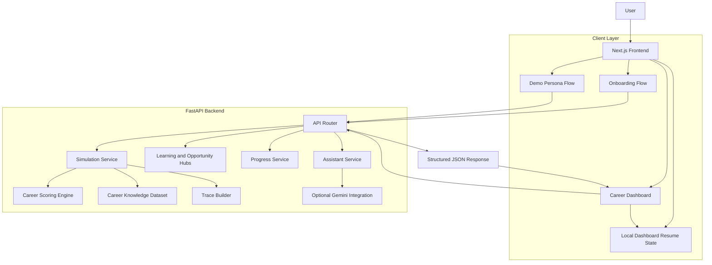
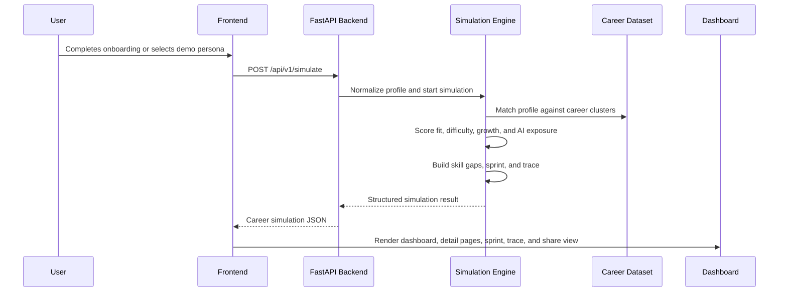
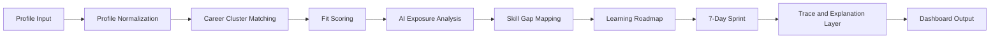
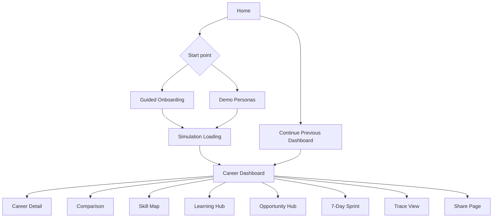

# Daedalus

**Daedalus** is an AI-powered career navigation platform that helps users compare future career paths, understand skill gaps, analyze AI exposure, and turn career uncertainty into a practical action plan.

It is built as a structured career decision system rather than a generic chatbot. A user completes a guided profile, Daedalus generates a career simulation, and the product presents the result through a dashboard, comparison layer, learning roadmap, opportunity hub, 7-day sprint, and traceable recommendation pipeline.

**Live product:** https://daedalus-iota.vercel.app/

---

## Product Overview

| Area | Details |
|---|---|
| Product type | AI career navigation and decision platform |
| Core users | Students and early professionals exploring AI-era career paths |
| Main outcome | Personalized career options, skill gaps, AI exposure, roadmap, and sprint plan |
| Frontend | Next.js, React, Tailwind CSS, Radix UI, Framer Motion |
| Backend | FastAPI, Pydantic, SQLAlchemy, SQLite, optional Gemini assistant |
| Deployment | Frontend on Vercel; backend deployed as a private FastAPI service |
| Current status | End-to-end MVP deployed and working |

---

## Why Daedalus Exists

Career planning is fragmented. Users often move between career quizzes, resume tools, interview platforms, learning sites, job boards, and generic AI chatbots without getting a clear decision path.

Daedalus brings the core decision workflow into one product:

```text
Who am I?
What paths fit me?
How is AI changing those paths?
What skills am I missing?
What should I do this week?
```

The product does not claim to choose a user's future. It helps users compare realistic options, understand tradeoffs, and take the next step.

---

## Key Capabilities

| Capability | Description |
|---|---|
| Guided profile onboarding | Captures interests, skills, work style, concerns, goals, and availability |
| Demo personas | Lets users explore the product instantly with predefined profiles |
| Career simulation | Generates three recommended career paths with scoring and rationale |
| Career dashboard | Presents fit, confidence, difficulty, growth, and AI exposure signals |
| Career detail pages | Explains why a path fits, what the work involves, and where AI assists |
| Comparison matrix | Compares recommended paths side by side |
| Skill map | Identifies matched skills, missing skills, and priority gaps |
| Learning hub | Recommends learning directions and resources for selected paths |
| Opportunity hub | Suggests relevant opportunities and exploration areas |
| 7-day action sprint | Converts guidance into daily tasks and deliverables |
| Progress tracking | Tracks sprint progress locally |
| Trace view | Shows the recommendation pipeline for explainability |
| Share page | Creates a clean summary of the user's career map |
| Assistant drawer | Optional assistant support with safe fallback when no AI key is configured |
| Resume dashboard flow | Lets returning users continue from their previous dashboard |

---

## System Architecture



---

## Career Simulation Workflow



---

## Recommendation Pipeline



---

## Main User Flow



Recommended product demo path:

```text
Home → Demo Personas → Select Persona → Loading → Dashboard → Sprint → Trace → Share
```

---

## Repository Structure

```text
Daedalus/
├── frontend/              # Next.js application
│   ├── app/               # App Router pages and routes
│   ├── components/        # UI, layout, dashboard, and feature components
│   ├── lib/               # API client, types, helpers, local storage utilities
│   └── package.json
│
├── backend/               # FastAPI service
│   ├── app/
│   │   ├── api/           # API routes
│   │   ├── core/          # Settings and infrastructure config
│   │   ├── schemas/       # Pydantic request/response schemas
│   │   └── services/      # Simulation, hubs, assistant, and progress logic
│   ├── requirements.txt
│   └── runtime config
│
├── docs/                  # Architecture, API, deployment, and testing notes
├── README.md
└── .gitignore
```

---

## API Surface

The backend URL is intentionally not listed publicly. The frontend communicates with the backend through `NEXT_PUBLIC_API_BASE_URL`.

| Method | Endpoint | Purpose |
|---|---|---|
| `GET` | `/api/v1/health` | Backend health check |
| `GET` | `/api/v1/demo-personas` | Preset user profiles |
| `POST` | `/api/v1/simulate` | Generate career simulation |
| `GET` | `/api/v1/simulations/{simulation_id}` | Fetch cached simulation |
| `POST` | `/api/v1/hubs/opportunities` | Opportunity recommendations |
| `GET` | `/api/v1/hubs/learning-path/{career_id}` | Learning resources |
| `GET` | `/api/v1/progress/{simulation_id}` | Fetch progress state |
| `POST` | `/api/v1/progress/update` | Update sprint progress |
| `POST` | `/api/v1/assistant/chat` | Optional assistant chat |
| `POST` | `/api/v1/assistant/automate` | Optional generated assets |
| `POST` | `/api/v1/feedback` | Capture feedback |

See `docs/API_CONTRACTS.md` for request and response shapes.

---

## Local Setup

### Prerequisites

| Tool | Recommended version |
|---|---|
| Node.js | 20.x or later |
| npm | Latest stable |
| Python | 3.11 or 3.12 |
| Git | Latest stable |

Avoid Python 3.14 for the backend because some compiled Python dependencies may not support it cleanly yet.

---

### Backend Setup

```bash
cd backend
python -m venv .venv
```

Windows CMD:

```cmd
.venv\Scripts\activate
```

macOS/Linux:

```bash
source .venv/bin/activate
```

Install dependencies:

```bash
pip install -r requirements.txt
```

Create environment file:

```bash
cp .env.example .env
```

Windows CMD:

```cmd
copy .env.example .env
```

Run backend:

```bash
uvicorn app.main:app --reload --port 8000
```

Health check:

```text
http://localhost:8000/api/v1/health
```

---

### Frontend Setup

```bash
cd frontend
npm install
```

Create environment file:

```bash
cp .env.example .env.local
```

Windows CMD:

```cmd
copy .env.example .env.local
```

Set local API base URL:

```env
NEXT_PUBLIC_API_BASE_URL=http://localhost:8000
```

Run frontend:

```bash
npm run dev
```

Open:

```text
http://localhost:3000
```

---

## Environment Variables

### Frontend

```env
NEXT_PUBLIC_API_BASE_URL=http://localhost:8000
```

For production, set this in the hosting dashboard to the deployed backend service URL. The backend URL is not published in this README.

### Backend

```env
PROJECT_NAME=Daedalus API
VERSION=1.0.0
API_V1_STR=/api/v1
ENVIRONMENT=development
ALLOWED_ORIGINS=http://localhost:3000,http://localhost:5173
LOG_LEVEL=info
```

Optional:

```env
GOOGLE_API_KEY=<your-key>
```

If `GOOGLE_API_KEY` is absent, the assistant uses safe fallback responses and the core product flow still works.

---

## Build and Verification

Frontend production build:

```bash
cd frontend
npm run build
```

Backend smoke test:

```bash
cd backend
python scripts/test_api_flow.py
```

Manual test path:

```text
Home
→ Demo Personas
→ Select Persona
→ Loading
→ Dashboard
→ Career Detail
→ Skills
→ Learning
→ Opportunities
→ Sprint
→ Trace
→ Share
→ Home
→ Continue
```

Manual onboarding test:

```text
Name: Dhruv
Interest: AI
Subject: Computer Science
Skill: Python
Work style: Building
Fear: Automation
Weekly time: 5-7 hours
```

---

## Deployment

Current deployment:

| Layer | Platform |
|---|---|
| Frontend | Vercel |
| Backend | Private FastAPI service |

Production frontend:

```text
https://daedalus-iota.vercel.app/
```

Deployment rule:

```text
Deploy backend first → set NEXT_PUBLIC_API_BASE_URL in frontend → deploy frontend
```

The backend URL is intentionally not displayed publicly. Treat it as an implementation detail.

---

## Design Principles

Daedalus follows four product principles:

| Principle | Meaning |
|---|---|
| Structured decisions over generic chat | The product guides users through a decision system, not a loose conversation |
| Comparison over one-answer certainty | Users see multiple paths and tradeoffs rather than one fake perfect answer |
| Action over motivation | Every simulation leads to a concrete sprint |
| Explainability over black box output | Trace view shows how the recommendation was produced |

---

## Current Status

Daedalus has a complete end-to-end MVP flow:

- Onboarding
- Demo profiles
- Career simulation
- Dashboard
- Career detail pages
- Comparison
- Skill mapping
- Learning and opportunity modules
- Progress tracking
- 7-day sprint
- Trace view
- Share page
- Dashboard resume flow
- Live frontend deployment

Current technical limitation:

The backend currently uses lightweight persistence suitable for the MVP. Durable multi-user persistence should be added before a production-grade public release.

---

## Team

| Member | Role |
|---|---|
| Dhruv Gupta | Integration, deployment, testing, and final product packaging |
| Akshhaya Isa | Frontend |
| Pavit Agrawal | Backend |

---

## License

License to be decided.
