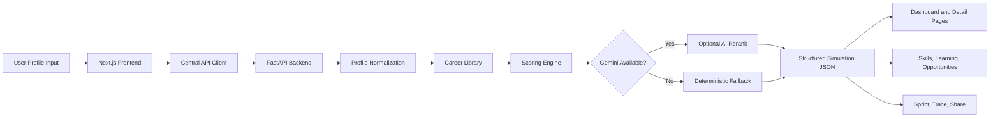
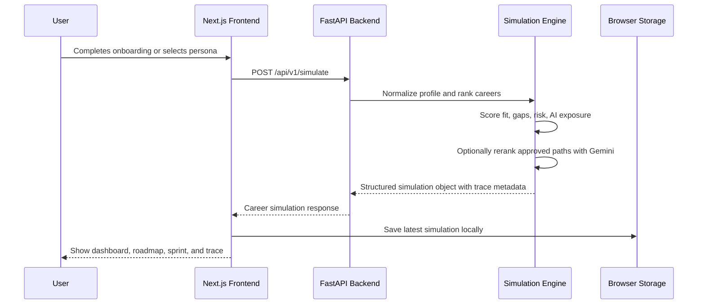
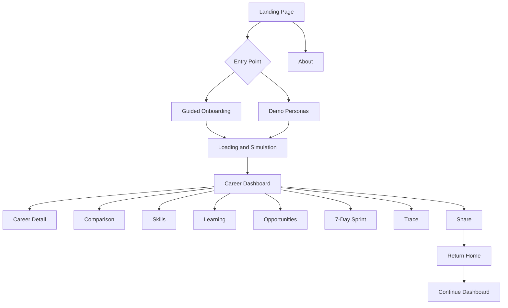

<div align="center">

# Daedalus

**AI-powered career navigation for clearer future decisions.**

Daedalus helps users compare future career paths, understand skill gaps, evaluate AI exposure, and convert career uncertainty into a practical action plan.

[Live Product](https://daedalus-iota.vercel.app/)

</div>

---

## Overview

Daedalus is a structured career decision platform. A user completes a guided profile, receives a personalized career simulation, and explores the result through a dashboard, career comparison layer, learning roadmap, opportunity hub, 7-day sprint, and traceable recommendation pipeline.

The product is deliberately **not** a generic chatbot. The core experience is built around structured data, deterministic scoring, explainable recommendations, and an interface that helps users move from uncertainty to action.

---

## Product Snapshot

| Area | Details |
|---|---|
| Product type | AI career navigation and decision platform |
| Core users | Students and early professionals exploring AI-era career paths |
| Main outcome | Personalized career options, skill gaps, AI exposure analysis, roadmap, and sprint plan |
| Frontend | Next.js, React, Tailwind CSS, Radix UI, Framer Motion |
| Backend | FastAPI, Pydantic, SQLAlchemy, SQLite, optional Gemini assistant |
| Deployment | Frontend on Vercel; backend deployed as a private Python/FastAPI service |
| Live product | https://daedalus-iota.vercel.app/ |

---

## Core Capabilities

| Capability | What it does |
|---|---|
| Guided onboarding | Captures interests, skills, work style, concerns, goals, and availability |
| Demo persona flow | Lets users explore the product instantly through preset profiles |
| Career simulation | Generates three recommended paths with fit, confidence, difficulty, growth, and AI exposure signals |
| Career dashboard | Presents the complete recommendation system through an interactive operating view |
| Career details | Breaks down path fit, required skills, human advantage, and AI exposure by task |
| Comparison matrix | Helps users compare recommended paths side by side |
| Skill map | Shows current strengths and priority skill gaps |
| Learning hub | Recommends learning resources for the selected career path |
| Opportunity hub | Surfaces relevant internships, competitions, and project opportunities |
| 7-day sprint | Converts the recommendation into an immediate action plan |
| Trace view | Explains deterministic scoring, Gemini reranking status, and recommendation logic |
| About page | Explains the product, innovation, social relevance, video slot, and developer contributions |
| Share page | Creates a clean summary of the user’s career map |
| Resume flow | Lets returning users continue their most recent dashboard from the home page |

---

## System Architecture



---

## Recommendation Workflow



---

## Frontend Structure

```text
frontend/
├── app/                         # Next.js App Router pages
│   ├── page.tsx                 # Landing page
│   ├── about/                   # Product explanation, demo video slot, and team
│   ├── onboarding/              # Guided profile flow
│   ├── loading/                 # Simulation execution state
│   ├── dashboard/[simulationId] # Main career dashboard
│   ├── career/[simulationId]    # Career detail view
│   ├── comparison/[simulationId]
│   ├── skills/[simulationId]
│   ├── learning/[simulationId]
│   ├── opportunities/[simulationId]
│   ├── sprint/[simulationId]
│   ├── trace/[simulationId]
│   └── share/[simulationId]
├── components/                  # Reusable UI and intelligence components
├── lib/api.ts                   # Centralized backend API client
├── lib/simulation-store.ts      # Local simulation persistence
└── lib/types.ts                 # Frontend contracts
```

---

## Backend Structure

```text
backend/
├── app/
│   ├── main.py                  # FastAPI app, CORS, routers, error handling
│   ├── api/v1/                  # Versioned API routes
│   ├── schemas/                 # Pydantic request/response contracts
│   ├── services/                # Simulation, assistant, learning, opportunity logic
│   ├── models/                  # SQLAlchemy models
│   ├── repositories/            # Persistence helpers
│   └── core/                    # Config, database, security helpers
├── requirements.txt
└── runtime.txt / .python-version where configured for deployment
```

---

## API Surface

The frontend talks to the backend through a small set of stable endpoints.

| Method | Endpoint | Purpose |
|---|---|---|
| GET | `/api/v1/health` | Service health check |
| GET | `/api/v1/demo-personas` | Preset profile library |
| POST | `/api/v1/simulate` | Main career simulation |
| GET | `/api/v1/simulations/{simulation_id}` | Retrieve cached simulation when available |
| POST | `/api/v1/hubs/opportunities` | Opportunity recommendations |
| GET | `/api/v1/hubs/learning-path/{career_id}` | Learning resources |
| GET | `/api/v1/progress/{simulation_id}` | Progress state |
| POST | `/api/v1/progress/update` | Update progress |
| GET | `/api/v1/assistant/status` | Gemini configuration diagnostics |
| POST | `/api/v1/assistant/chat` | Optional assistant chat |
| POST | `/api/v1/assistant/automate` | Optional generated assets |
| POST | `/api/v1/feedback` | Feedback capture |

The backend endpoint is intentionally not listed here. The deployed product should be accessed through the live frontend.

---

## Error Handling and Reliability

Daedalus includes several reliability safeguards:

- The frontend API client normalizes backend errors into readable user messages.
- Simulation requests retry once before showing a recovery state.
- The loading screen no longer resets users back to onboarding after a transient backend issue.
- The assistant returns a graceful fallback if Gemini is not configured or temporarily unavailable.
- Backend internal errors return a stable JSON shape instead of leaking stack traces in production.
- The dashboard stores the active simulation locally so returning users can continue from the landing page.

---

## Local Setup

### Backend

Use Python 3.11 or 3.12.

```bash
cd backend
python -m venv .venv
```

Windows CMD:

```cmd
.venv\Scripts\activate
```

macOS/Linux:

```bash
source .venv/bin/activate
```

Install dependencies:

```bash
pip install -r requirements.txt
```

Create environment file:

```bash
cp .env.example .env
```

Windows CMD:

```cmd
copy .env.example .env
```

Run backend:

```bash
uvicorn app.main:app --reload --port 8000
```

Health check:

```text
http://localhost:8000/api/v1/health
```

### Frontend

```bash
cd frontend
npm install
```

Create environment file:

```bash
cp .env.example .env.local
```

Windows CMD:

```cmd
copy .env.example .env.local
```

Run frontend:

```bash
npm run dev
```

Open:

```text
http://localhost:3000
```

---

## Environment Variables

### Frontend

```env
NEXT_PUBLIC_API_BASE_URL=http://localhost:8000
```

### Backend

```env
PROJECT_NAME=Daedalus API
VERSION=1.0.0
API_V1_STR=/api/v1
ENVIRONMENT=development
ALLOWED_ORIGINS=http://localhost:3000,http://localhost:5173
LOG_LEVEL=info
```

Optional:

```env
GOOGLE_API_KEY=<your-key>
```

If `GOOGLE_API_KEY` is absent, Daedalus uses deterministic simulation and fallback assistant responses. If it is present, Gemini can rerank approved career paths and generate assistant/automation responses. Check `/api/v1/assistant/status` in backend logs or directly during deployment debugging.

---

## Main Product Flow



---

## Build and Verification

Frontend production build:

```bash
cd frontend
npm run build
```

Backend checks:

```bash
cd backend
python -m compileall app
python scripts/test_api_flow.py
```

Manual product flow:

```text
Home → Demo Personas → Loading → Dashboard → Career Detail → Skills → Learning → Opportunities → Sprint → Trace → Share → Home → Continue
```

Gemini diagnostics:

```text
GET /api/v1/assistant/status
```

---

## Deployment

Current deployment shape:

| Layer | Platform | Notes |
|---|---|---|
| Frontend | Vercel | Public product URL |
| Backend | Render | Private FastAPI service consumed by the frontend |

Frontend production URL:

```text
https://daedalus-iota.vercel.app/
```

Backend deployment notes:

- Python 3.12 is recommended.
- Render start command: `uvicorn app.main:app --host 0.0.0.0 --port $PORT`
- CORS should allow the deployed Vercel frontend domain. Avoid trailing slashes in allowed origins.
- The backend URL is not documented publicly to reduce unnecessary direct traffic.

---

## Team

| Member | Contribution |
|---|---|
| Dhruv Gupta | Product direction, integration, deployment, testing, frontend/backend bug fixing, release packaging |
| Akshhaya Isa | Frontend implementation and interface development |
| Pavit Agrawal | Backend implementation and API development |

---

## Current Status

Daedalus is live with an end-to-end product flow covering onboarding, demo profiles, simulation, dashboard, detail pages, skill mapping, learning and opportunity modules, progress tracking, sprint planning, trace view, share page, and about page. The recommendation system now combines an expanded career library, deterministic fallback ranking, traceable scoring, and optional Gemini reranking when configured.

The current backend uses SQLite and runtime caching where applicable. For a larger multi-user release, persistence should move to a managed database such as Postgres, Supabase, or Neon.
