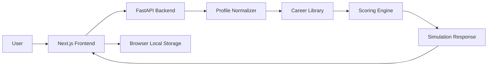

# Daedalus Architecture

Daedalus is split into a public Next.js frontend and a private FastAPI backend. The frontend owns the product experience. The backend owns structured career simulation, supporting data, progress state, and optional assistant responses.

## High-Level System



## Frontend Responsibilities

| Area | Location | Purpose |
|---|---|---|
| Landing | `frontend/app/page.tsx` | Product entry and continue-dashboard CTA |
| Onboarding | `frontend/app/onboarding/page.tsx` | Profile capture and validation |
| Loading | `frontend/app/loading/page.tsx` | Runs simulation, retries transient backend issues, saves result |
| Dashboard | `frontend/app/dashboard/[simulationId]/page.tsx` | Main career operating view |
| Detail modules | `frontend/app/*/[simulationId]/page.tsx` | Career detail, comparison, skills, sprint, learning, opportunities, trace, share |
| API client | `frontend/lib/api.ts` | Central backend communication and error normalization |
| Local state | `frontend/lib/simulation-store.ts` | Latest simulation persistence in the browser |

## Backend Responsibilities

| Area | Location | Purpose |
|---|---|---|
| App entry | `backend/app/main.py` | FastAPI app, CORS, routers, stable error handling |
| Schemas | `backend/app/schemas/` | Pydantic contracts |
| Simulation service | `backend/app/services/simulation_service.py` | Career ranking, skill mapping, action sprint, trace |
| Assistant service | `backend/app/services/ai_service.py` | Optional Gemini-backed assistant with offline fallback |
| Hubs | `backend/app/services/learning_service.py`, `opportunity_service.py` | Learning and opportunity recommendations |
| Persistence | `backend/app/core/database.py` | SQLite-backed supporting state |

## Primary Contract

The central contract is:

```http
POST /api/v1/simulate
```

It returns the simulation object consumed by the dashboard and all detail modules. This keeps the product predictable and reduces frontend/backend drift.

## Reliability Decisions

- Frontend retries transient backend failures once.
- Loading screen keeps users in place and offers recovery actions instead of resetting them.
- Assistant failures return graceful messages rather than breaking the dashboard.
- Production backend errors do not expose internal exception details.
- Browser localStorage keeps the latest simulation available for the continue-dashboard flow.
